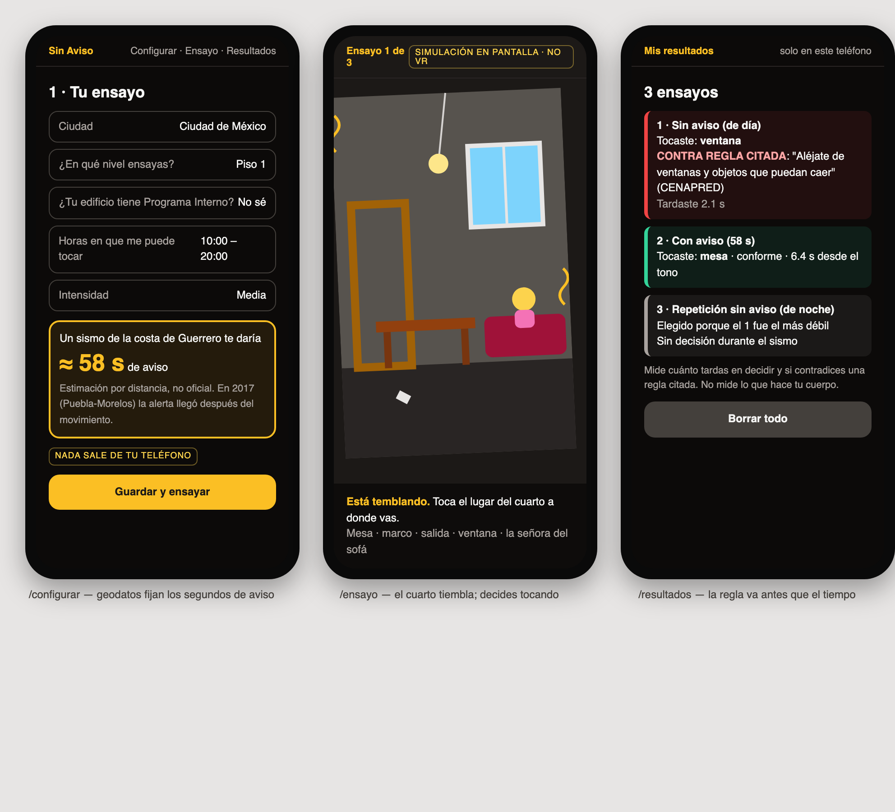
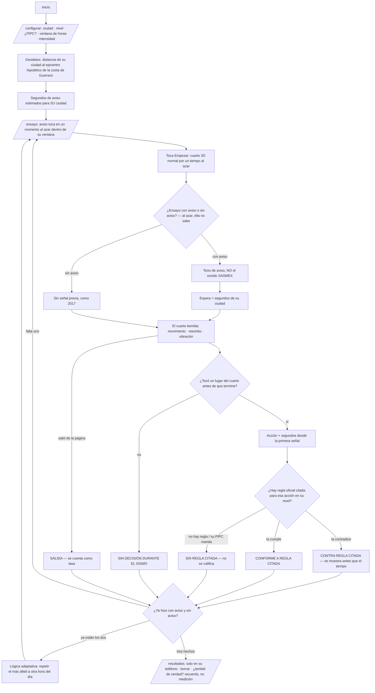
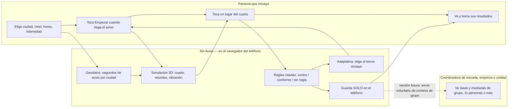

# Packet — w06-sinaviso · "Sin Aviso: ensaya el sismo que no avisa"

> Escrito ANTES del código (disciplina del curso). Semana 6 · Capítulo 5 "My Haunting Idol" · T7 · lente TECHNOLOGIST · Andrés Álvarez Morphy Namnum.
> **Blueprint T7: pendiente** (la sesión de Team Bending no ha ocurrido al escribir esto). El curso permite construir "the fused idea or their own surviving idea"; esta rebanada es la que sobrevivió en mi brief (vacío MEDICIÓN, sección 4). Cuando exista el Blueprint, la tabla "Condiciones → build" se actualiza contra sus condiciones.

## El problema, en mis palabras

México hace el simulacro más grande del mundo (37M+ registrados en mayo-2026) y ensaya siempre el caso fácil: **suena la alerta, sales caminando**. El 19-sep-2017 la alerta sonó en la CDMX **segundos después** de que empezó a temblar, dos horas después del simulacro de esa mañana. El caso que mata no tiene ensayo.

Y nadie mide nada. La métrica oficial es el tiempo de desalojo de un edificio; no encontré a nadie en México que mida siquiera lo que hace una persona dentro de un ensayo. En un sismo real la falla ocurre en el cuerpo (Christchurch 2011: 34% se congeló, 12% se agachó y cubrió), y un teléfono no puede ver el cuerpo. **Lo que un teléfono sí puede medir con honestidad es cuánto tardas en comprometerte con una decisión cuando te toma por sorpresa, y si esa decisión contradice una regla oficial citada.** Eso es preparación para decidir. No es conducta, y la app lo dice.

**Qué espera mata (Ley de Latencia):** los segundos entre "empezó a moverse" y "decidí qué hacer". En 2017 no hubo segundos de aviso; los únicos segundos disponibles eran los de la decisión.

**Posibilidad inflada (lección de la semana):** un modelo de mundos puede generar 3,000 escenarios. Sin Aviso da **tres ensayos, nunca treinta**: (1) sin aviso, (2) con aviso, (3) repetir el más débil a otra hora.

## Usuario exacto

- **La persona que ensaya en su casa**, con un Android de gama media, en la ventana de horas que ella elige.
- Persona para la prueba sintética: **"Doña Rosa Hernández"**, 61, vive en una casa autoconstruida de dos pisos en Iztapalapa (zona de lago), cuida a su mamá de 84 que usa andadera y duerme en planta baja. Motorola de MX$3,000, usa WhatsApp y Facebook, lee despacio, desde 2017 le da miedo el tema, y cuando algo no se entiende se sale sin decir nada. *(Persona inventada, construida desde la investigación de la semana; no es una persona real.)*
- **Segundo actor:** quien coordina una escuela, empresa o unidad habitacional y solo puede ver **números de grupo** (nunca individuales, nunca con menos de 11 personas).

## Definición de éxito

**Antes de que cierre el módulo**, en la URL viva, sin cuenta y sin que nada salga del teléfono:
1. En `/configurar`, la persona elige ciudad, nivel del piso, si su edificio tiene Programa Interno, su ventana de horas y la intensidad. La app le dice **cuántos segundos de aviso daría un sismo de la costa de Guerrero en su ciudad** (estimación por distancia, etiquetada).
2. En `/ensayo`, un aviso "toca la puerta" en un momento al azar; al tocar **Empezar**, un cuarto 3D normal se ve un tiempo al azar y **empieza a temblar** (cuarto que se mueve, retumbo, vibración en Android). En la mitad de los ensayos hay tono de aviso antes (nunca el sonido SASMEX) con los segundos de SU ciudad; en la otra mitad no hay aviso. Ella no sabe cuál le toca.
3. La decisión es **tocar un lugar del cuarto** (mesa, marco de la puerta, salida, ventana, la persona en el sofá). El reloj arranca con la primera señal (tono o movimiento). Sin toque = "sin decisión durante el sismo", nunca "se congeló". Salir de la página = "salida", contada como tasa.
4. Tras dos ensayos, la app **elige el tercero**: repite el más débil a otra hora del día.
5. En `/resultados` ve sus tres ensayos: primero si su acción **contradice una regla citada** (con la cita), después el tiempo. Solo ella lo ve; puede borrarlo.
6. En `/grupo`, una coordinadora ve **tasas** (sin decisión, salidas, contra regla) y medianas con/sin aviso, con **datos inventados etiquetados** y grupos de menos de 11 ocultos.

## Mockup (generado)

*Sin generador de imágenes disponible en el stack gratuito (el AI Gateway de Vercel del equipo class19 no da acceso en el plan gratis, lección de la semana 5), el mockup se generó por código (HTML → Playwright) antes de escribir la app, igual que en las semanas 4 y 5.*

## Flujo

## Benchmark

**La mejor solución existente en el mundo para esto es** la simulación de phishing (KnowBe4: tasa de falla 33.1% → 4.1% en 12 meses, 2025) para la medición, y los simuladores de vuelo calificados por la FAA (14 CFR Part 60: sabes que viene una falla, no cuál ni cuándo) para el ensayo. **La mía se diferencia/localiza en que** ensaya el caso mexicano que ningún simulacro ensaya (el sismo sin aviso de 2017), calcula el aviso con la geografía de TU ciudad, califica solo contra reglas oficiales mexicanas citadas (CENAPRED, STCONAPRA) y corre en el navegador de un Android de MX$3,000 sin visor, porque el clic del phishing no existe en un sismo y el canal real (SASMEX) no se puede imitar.

## Vista larga (3 oraciones)

Si esta rebanada funciona, en tres años Sin Aviso es el ensayo personal que complementa el Simulacro Nacional: el Estado ensaya el canal (altavoces, Cell Broadcast), y cada casa ensaya la decisión sin aviso, con el tono y los segundos de su ciudad. Los conteos de grupo que la gente decida enviar serían la primera línea base pública de "sin decisión" y "contra regla" en México, con ensayos con y sin aviso para validar que la escena sí recrea 2017 y con temblores calibrados con registros reales. Los muros de carga: nada individual sale del teléfono, la app nunca escribe su propia regla, tres ensayos y no treinta, y nunca el sonido SASMEX.

## Recorte de alcance (lo que NO construyo esta semana)

- **Sin push real desde servidor.** En esta versión el "toque" lo lanza la página abierta (y una notificación local si el teléfono da permiso). Un push a hora al azar necesita suscripciones guardadas y un programador: fuera de alcance y etiquetado en pantalla.
- **Sin sensores:** sin cámara, micrófono, GPS ni acelerómetro. (La cámara murió en la pelea: MediaPipe no distingue "congelarse" de "leer la pantalla" y no te ve bajo la mesa.)
- **Sin VR/visor:** es una simulación en pantalla, etiquetada. Sin WebXR (iPhone no lo tiene).
- **El temblor es inventado:** duración y forma no vienen de un registro real (pendiente: registros acelerográficos de UNAM). La pantalla lo dice.
- **Sin cuentas, sin base de datos:** todo vive en `localStorage` del teléfono. `/grupo` usa **datos inventados**.
- **No es la guía oficial de protección civil** ni la reemplaza; donde el edificio tiene Programa Interno, manda su plan y la acción no se califica.
- **Sin LLM:** la lógica adaptativa es por reglas. (Gateway gratuito bloqueado para modelos útiles, semana 5.)

## Condiciones → cómo las honra el build

*Blueprint T7 pendiente. Mientras tanto, las condiciones de mi brief (sección 5, la sombra) son las que el build honra; se mapearán a las del Blueprint cuando exista.*

| Condición (brief) | Cómo |
|---|---|
| 1. La persona tiene el control (hora e intensidad) | `/configurar`: ventana de horas e intensidad; horas de dormir apagadas por defecto; la app elige un momento al azar dentro de esa ventana **sin observar nada** para elegirlo. |
| 2. Sin sensores | Ni cámara, ni micrófono, ni GPS, ni acelerómetro. La ciudad se elige de una lista. |
| 3. Resultados individuales solo para la persona | `localStorage`, botón "Borrar todo". Grupos solo con tasas y 11 personas o más; menos de 11 → "grupo muy chico, no se muestra". |
| 4. Congelarse y salir son tasas, nunca se descartan | "Sin decisión durante el sismo" y "salida" aparecen como porcentaje en resultados y en grupo. |
| 5. Nunca el sonido SASMEX | Tono propio de tres notas suaves, generado en el navegador. |
| 6. La app no escribe la regla | Cada acción se califica solo con regla oficial citada (CENAPRED, STCONAPRA); si no hay regla, o manda el PIPC del edificio → "sin regla citada, no se califica". Una acción rápida que contradice una regla aparece **antes** que su tiempo. |

## Stack del dragón (multiplica, no suma)

**Simulación 3D** × **lógica adaptativa** × **geodatos.** Los geodatos fijan la variable que la simulación manipula (segundos entre tono y temblor, por ciudad); la simulación produce el resultado que la lógica adaptativa usa para elegir el tercer ensayo. Si Acapulco da ~0 s de aviso para un sismo de la costa, su "ensayo con aviso" casi se vuelve "sin aviso", y la app se lo dice: la geografía cambia el ensayo.

## Arquitectura y stack

| Capa | Elección | Por qué |
|---|---|---|
| Framework | Next.js 15 (App Router, JS) + Tailwind 4 | plantilla del curso |
| Simulación | three.js en un componente cliente: cuarto con mesa, marco de puerta, salida (escalera o puerta a la calle según nivel), ventana, persona en el sofá, lámpara que se balancea, objetos que caen; toque = raycasting | corre en el navegador de un Android de gama media; sin visor; etiquetado "simulación en pantalla" |
| Audio / háptica | WebAudio (retumbo de ruido filtrado, tono propio de aviso) + `navigator.vibrate` | sin archivos de audio; nunca el sonido SASMEX |
| Geodatos | `lib/ensayo.js`: coordenadas de ciudades de los 11 estados con altavoces SASMEX + epicentro hipotético del 1er Simulacro Nacional 2026 (M8.2, 55 km al NO de Acapulco); aviso ≈ distancia / 3.5 km/s − 20 s, mínimo 0 | estimación simple calibrada a "hasta ~60 s para CDMX" (SASMEX); etiquetada como no oficial |
| Reglas | `lib/ensayo.js`: R1 ventanas (CENAPRED), R2 no evacuar en piso 4 o más (STCONAPRA vía Infobae), R3 evacuar por escaleras permitido en los primeros 2–3 pisos (misma fuente), piso 3 = zona gris; PIPC manda | la app nunca escribe su propia regla |
| Adaptativa | `siguienteEnsayo()`: orden al azar de con/sin aviso; tercero = el más débil (contra regla > salida > sin decisión > más lento) a otra hora del día (luz de día/noche) | tres ensayos, nunca treinta |
| Persistencia | `localStorage` únicamente | sin datos personales en servidor → sin auth ni RLS |
| Hosting | Vercel (equipo `class19`) | |

## Piso de seguridad

1. **Secretos:** ninguno (no hay API keys). 2. **Auth:** no aplica porque nada personal llega al servidor, y la pantalla lo dice. 3. **RLS:** no aplica (sin base de datos). 4. **Validación:** listas cerradas para ciudad, nivel, intensidad; horas enteras 0–23 validadas; lo leído de `localStorage` se valida antes de usarse. 5. **Datos inventados** en `/grupo` y en la persona, etiquetados.

## Plan de prueba

**Mecánico** (`node --test` sobre `lib/ensayo.js` + Playwright contra producción a 390 px):
- a) CDMX → aviso ≈ 55–62 s; Acapulco → 0 s; Chilpancingo < 15 s.
- b) Piso 4+ y toca "salida" → CONTRA REGLA CITADA (R2); planta baja y "salida" → CONFORME (R3); piso 3 y "salida" → SIN REGLA CLARA.
- c) Cualquier nivel y "ventana" → CONTRA REGLA CITADA (R1); "marco de la puerta" → SIN REGLA CITADA; con PIPC → nada se califica.
- d) `siguienteEnsayo`: si el sin aviso fue "contra regla" y el con aviso fue rápido y conforme → el tercero repite "sin aviso" a otra hora.
- e) Resumen: sin decisión y salidas cuentan en el denominador (no desaparecen); el promedio no mejora al quitar a quien se congeló.
- f) Grupo con 7 personas → oculto; con 11 → visible.
- g) `localStorage` corrupto o con valores fuera de lista → se ignora y se vuelve a configurar.
- h) Producción: las 6 rutas 200, 404 en ruta inexistente, 390 px sin scroll horizontal, sin errores de consola; un ensayo completo en `?demo=1` termina con resultado guardado.

**Persona (Doña Rosa):** capturas de teléfono de inicio → configurar → ensayo (antes, durante, después) → resultados → grupo, en un agente nuevo, como ella. Registrar cada confusión, corregir la peor y redesplegar.
